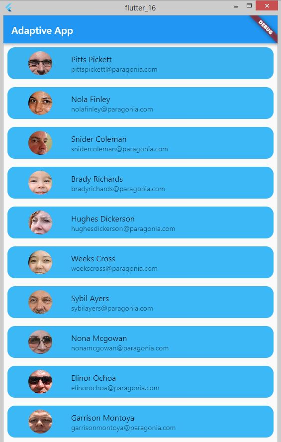
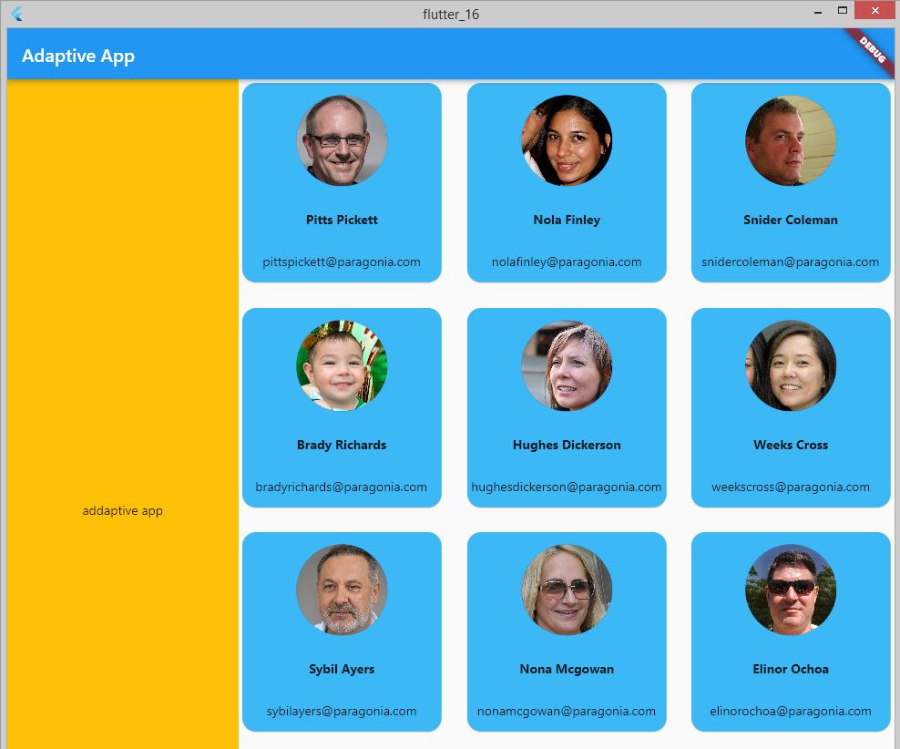
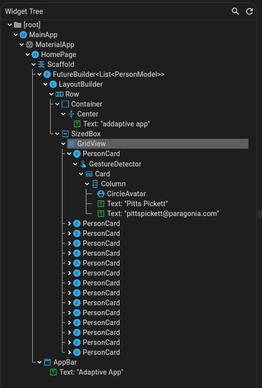
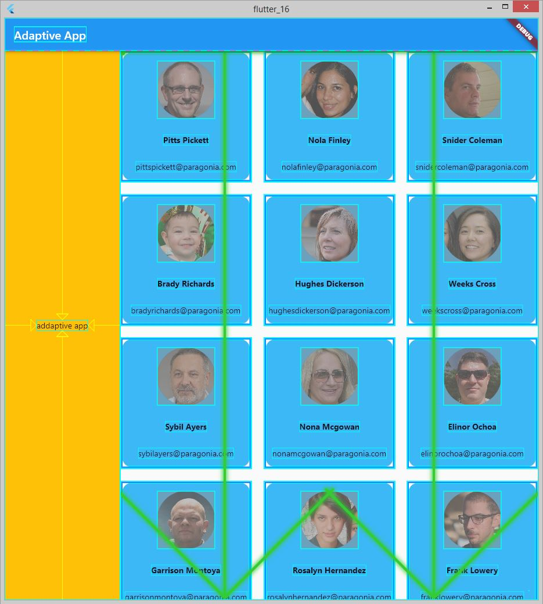
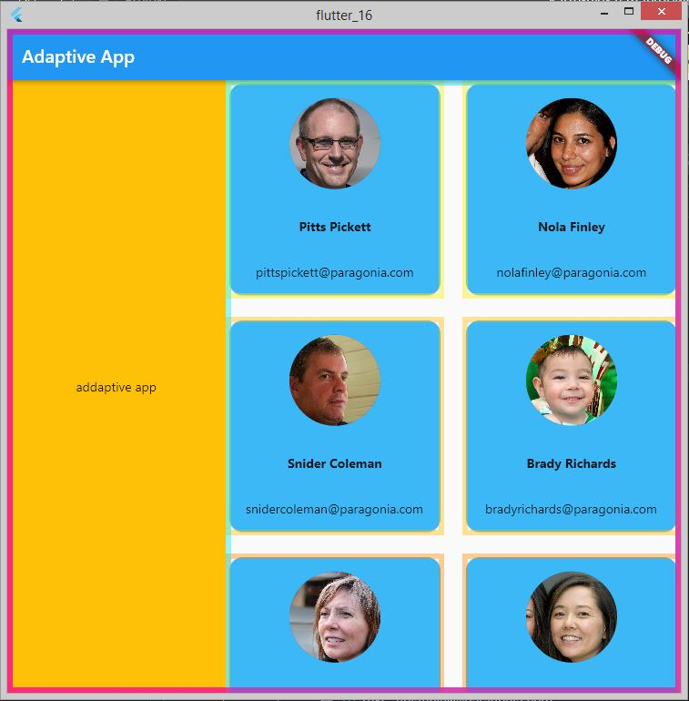
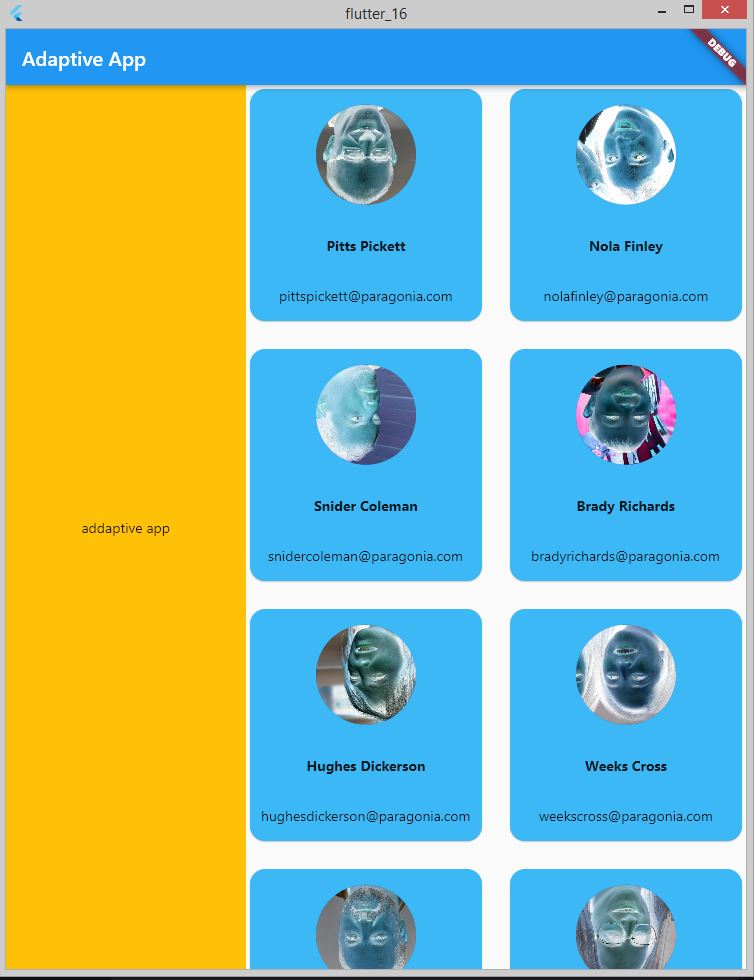

# Flutter 20. Работа с DevTools

Для анализа используется приложение со сложным адаптивным лэйаутом.

\
<b>Вид приложения при ширине менее 720</b>
 
 
\
<b>Вид приложения при ширине более 720</b>
 
 
Дерево виджетов выглядит следующим образом:\
\
<b>Дерево виджетов</b>
 
 
Инструмент Show Guidelines показывает направление скролла и проблемы с лэйаутом. В данном примере проблем с лэйаутом нет\
\
<b>Использование инструмета Show Guidelines</b>
 
 
Инструмент Highligth Repaints показывает какие части приложения перерисовываются. В данном примере это все приложение при изменении размера и карточки, которые перерисовываются при появлении.\
\
<b>Использование инструмета Highligth Repaints</b>
 
 
Инструмент Highlight Images выделяет картинки, которые потребляют слишком много памяти. В данном примере это вызвано тем, что изначально картинки большого размера, из-за чего приходиться их уменьшать, чтобы они поместились в виджет \
\
<b>Использование инструмета  Highlight Images</b>
 
 
